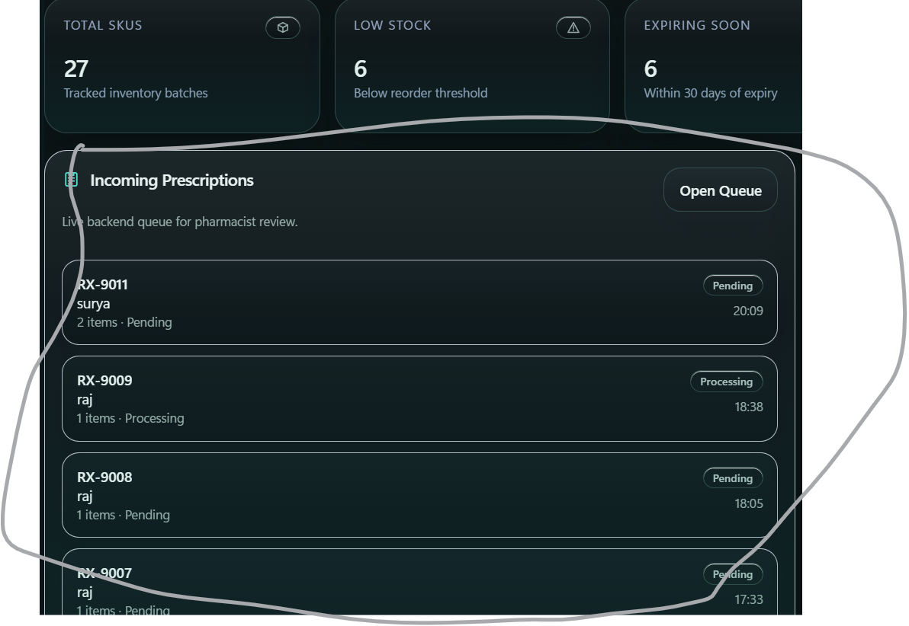

# 🏥 PIMS — Pharmacy Information Management System

> A production-grade, full-stack web application for managing prescriptions, patients, inventory, and pharmacy workflows. Built as a multi-role platform serving Doctors, Pharmacists, Administrators, and Patients.

---

## 📑 Table of Contents

- [Overview](#overview)
- [Live Demo](#live-demo)
- [Architecture](#architecture)
- [Monorepo Structure](#monorepo-structure)
- [User Roles & Capabilities](#user-roles--capabilities)
- [Feature Map](#feature-map)
- [Tech Stack](#tech-stack)
- [Getting Started](#getting-started)
- [Environment Variables](#environment-variables)
- [Database Seeding](#database-seeding)
- [Deployment](#deployment)
- [API Overview](#api-overview)
- [Security Model](#security-model)
- [Contributing](#contributing)

---

## Overview

PIMS is a comprehensive **Pharmacy Information Management System** designed for healthcare environments. It digitizes the entire prescription lifecycle — from doctor issuance to pharmacist fulfilment — while providing real-time inventory management, patient portal access, automated email notifications, PDF generation, and admin-level user governance.

Key design principles:
- **Role-based access control (RBAC)** — every route, API endpoint, and UI element is gated by the authenticated user's role
- **Audit-first** — all inventory mutations are logged to an immutable audit trail
- **Real-time inventory enforcement** — prescriptions cannot be marked "Filled" unless sufficient stock exists in the inventory
- **Patient-centric portal** — patients receive secure, dedicated login credentials to view their own prescriptions and medical history

---

## Live Demo

| System | URL |
|---|---|
| Frontend (Vercel) | [https://pims-sys.vercel.app](https://pims-sys.vercel.app) |
| Backend API (Render) | [https://pharmacy-information-management-system.onrender.com/api](https://pharmacy-information-management-system.onrender.com/api) |
| Health Check | `/api/health` |

---

## Architecture

```
┌───────────────────────────────────────────────────────────┐
│                    CLIENT BROWSER                         │
│          React 18 + Redux Toolkit + Vite                  │
│          (Hosted on Vercel)                               │
└────────────────────┬──────────────────────────────────────┘
                     │  HTTPS / REST API
                     ▼
┌───────────────────────────────────────────────────────────┐
│                    BACKEND (Node.js)                      │
│          Express.js REST API                              │
│          JWT Auth · Helmet · Rate Limiting                │
│          (Hosted on Render)                               │
└────────────────────┬──────────────────────────────────────┘
                     │  Mongoose ODM
                     ▼
┌───────────────────────────────────────────────────────────┐
│                  MongoDB Atlas                             │
│          8 Collections · Indexed Queries                  │
│          (Cloud Database)                                 │
└───────────────────────────────────────────────────────────┘
```

**Request Flow:**
1. User logs in → receives JWT stored in `localStorage`
2. Every API request sends the JWT in `Authorization: Bearer <token>` header
3. Backend validates JWT, checks role, then routes to the appropriate controller
4. Controllers delegate to service layer → service layer queries MongoDB via Mongoose
5. Response is returned as JSON; Redux stores it in the global UI state

---

## Monorepo Structure

```
pims/
├── Frontend/                  # React application (Vite)
│   ├── src/
│   │   ├── api/               # Axios API client (pimsApi.js)
│   │   ├── components/        # Shared UI components
│   │   ├── constants/         # Roles, route paths
│   │   ├── hooks/             # Custom React hooks
│   │   ├── layouts/           # MainLayout, PatientLayout
│   │   ├── pages/             # All page components (27 pages)
│   │   ├── routes/            # React Router + ProtectedRoute
│   │   ├── store/             # Redux Toolkit store & slices
│   │   ├── styles/            # Global CSS design system
│   │   └── utils/             # session.js, token helpers
│   ├── index.html
│   ├── vite.config.js
│   └── package.json
│
├── Backend/                   # Node.js REST API (Express)
│   ├── src/
│   │   ├── app.js             # Express app setup (CORS, helmet, rate limiter)
│   │   ├── server.js          # Entry point, DB connection
│   │   ├── config/            # DB config, environment loader
│   │   ├── controllers/       # Route handlers (thin layer)
│   │   ├── services/          # Business logic (fat layer)
│   │   ├── models/            # Mongoose schemas (8 models)
│   │   ├── routes/            # Express routers (11 route files)
│   │   ├── middlewares/       # Auth, role guard, rate limiter, error handler
│   │   ├── validators/        # Request validation
│   │   ├── utils/             # Shared utilities
│   │   ├── jobs/              # Data seeding jobs
│   │   └── data/              # Static seed data (ATC, medicines)
│   ├── scripts/               # Build, seed, and verification scripts
│   ├── tests/                 # Jest integration tests
│   └── package.json
│
├── vercel.json                # Vercel deployment configuration
├── package.json               # Root workspace scripts
└── README.md                  # ← You are here
```

---

## User Roles & Capabilities

PIMS supports four distinct user roles, each with its own login portal and feature set:

### 👨‍⚕️ Doctor
- **Login Portal:** `/doctor/access` → `/doctor/login`
- **Home:** `/dashboard`
- **Capabilities:**
  - View personal dashboard (today's prescriptions, patient stats)
  - Create new prescriptions with medicine picker and patient search
  - View full patient medical records and prescription history
  - Browse ATC Classification tree (WHO drug classification)
  - Automatically creates patient portal accounts on prescription submission
  - Change password

### 💊 Pharmacist
- **Login Portal:** `/pharmacist/access` → `/pharmacist/login`
- **Home:** `/pharmacist`
- **Capabilities:**
  - View pharmacist dashboard (pending queue, inventory alerts, today's fills)
  - Browse all prescriptions (filter by status, sort, paginate)
  - Mark prescriptions as **Processing** or **Filled** (with inventory enforcement)
  - Mark prescriptions as **Cancelled**
  - Confirm status changes via custom modal (no browser popups)
  - View patient record details for any prescription
  - Full inventory management (add/edit/delete batches, restock)
  - Inventory audit log
  - Manage pharmacy alerts (low stock, near expiry notifications)
  - Change password

### 🛠️ Admin
- **Login Portal:** `/admin/access` → `/admin/login`
- **Home:** `/admin`
- **Capabilities:**
  - Admin dashboard (system-wide KPIs)
  - Full user management (create, activate/deactivate, permanently delete)
  - Create patient portal accounts for existing patients
  - View and manage all system users
  - Inventory audit log
  - System-wide reports (prescriptions, revenue, inventory trends)
  - Change password

### 🧑‍💼 Patient
- **Login Portal:** `/patient/access` → `/patient/login`
- **Home:** `/patient`
- **Capabilities:**
  - Personal dashboard (upcoming prescriptions, health summary)
  - View own prescription history with medicine details
  - Update personal profile (allergies, contact info, address)
  - Change password

---

## Feature Map

| Feature | Doctor | Pharmacist | Admin | Patient |
|---|:---:|:---:|:---:|:---:|
| Role-based dashboard | ✅ | ✅ | ✅ | ✅ |
| Create prescription | ✅ | ❌ | ❌ | ❌ |
| View prescriptions | ✅ | ✅ | ❌ | ✅ (own only) |
| Fill / process prescriptions | ❌ | ✅ | ❌ | ❌ |
| View patient records | ✅ | ✅ | ❌ | ❌ |
| Inventory management | ❌ | ✅ | ❌ | ❌ |
| Inventory audit log | ❌ | ✅ | ✅ | ❌ |
| ATC Classification browser | ✅ | ❌ | ✅ | ❌ |
| System alerts | ❌ | ✅ | ❌ | ❌ |
| Reports & analytics | ❌ | ❌ | ✅ | ❌ |
| User management | ❌ | ❌ | ✅ | ❌ |
| Patient portal creation | ✅ | ❌ | ✅ | ❌ |
| PDF prescription download | ✅ | ✅ | ❌ | ✅ |
| Change password | ✅ | ✅ | ✅ | ✅ |

---

## Tech Stack

### Frontend
| Technology | Version | Purpose |
|---|---|---|
| React | 18.3.x | UI framework |
| Vite | 5.x | Build tool & dev server |
| Redux Toolkit | 2.x | Global state management |
| React Router | 6.x | Client-side routing |
| Axios | 1.x | HTTP client |
| Vanilla CSS | — | Styling (custom design system) |

### Backend
| Technology | Version | Purpose |
|---|---|---|
| Node.js | 18+ | Runtime |
| Express.js | 4.x | Web framework |
| MongoDB + Mongoose | 8.x | Database & ODM |
| JSON Web Tokens | 9.x | Authentication |
| Helmet | 7.x | HTTP security headers |
| Morgan | 1.x | HTTP request logging |
| Express Rate Limit | 8.x | API rate limiting |
| Nodemailer | 8.x | Email (SMTP) delivery |
| PDFKit | 0.18.x | Prescription PDF generation |
| Jest + Supertest | — | Integration testing |

### Infrastructure
| Service | Provider |
|---|---|
| Frontend hosting | Vercel |
| Backend hosting | Render |
| Database | MongoDB Atlas |
| Email | SMTP (configurable) |

---

## Getting Started

### Prerequisites
- Node.js ≥ 18
- npm ≥ 9
- A MongoDB Atlas cluster (or local MongoDB)

### 1. Clone the repository
```bash
git clone https://github.com/mdsamimrrza/-Pharmacy-Information-Management-System.git
cd pims
```

### 2. Install all dependencies
```bash
# Install root workspace dependencies
npm install

# Install backend dependencies
cd Backend && npm install && cd ..

# Install frontend dependencies
cd Frontend && npm install && cd ..
```

### 3. Configure environment variables
See [Environment Variables](#environment-variables) section below.

### 4. Seed the database
```bash
cd Backend
node scripts/master-seed.mjs
```

### 5. Start development servers

**Backend (Terminal 1):**
```bash
cd Backend
npm run dev
```
Runs on `http://localhost:5000`

**Frontend (Terminal 2):**
```bash
cd Frontend
npm run dev
```
Runs on `http://localhost:5173`

---

## Environment Variables

### Backend — `Backend/.env`
```env
# Server
PORT=5000
NODE_ENV=development

# Database
MONGO_URI=mongodb+srv://<user>:<password>@cluster.mongodb.net/pims

# Authentication
JWT_SECRET=your_super_secret_jwt_key_here
JWT_EXPIRES_IN=7d

# CORS
CLIENT_URL=http://localhost:5173

# Email (SMTP)
SMTP_HOST=smtp.gmail.com
SMTP_PORT=587
SMTP_USER=your@gmail.com
SMTP_PASS=your_app_password
SMTP_FROM=PIMS System <your@gmail.com>
```

### Frontend — `Frontend/.env`
```env
VITE_API_BASE_URL=http://localhost:5000/api
```

---

## Database Seeding

The master seed script creates a complete, production-ready baseline dataset including all user roles, sample patients, medicines, inventory, and prescriptions.

```bash
cd Backend
node scripts/master-seed.mjs
```

**What it seeds:**
| Entity | Count | Details |
|---|---|---|
| Users | 4 | 1 Doctor, 1 Pharmacist, 1 Admin, 1 Patient |
| Medicines | ~20 | Common drugs with ATC codes |
| Inventory | ~20 batches | Stock levels, expiry dates, thresholds |
| Patients | 2 | With allergies and medical history |
| Prescriptions | 5 | Mix of statuses (Pending, Processing, Filled) |
| ATC Codes | ~200 | WHO ATC classification data |

> ⚠️ **Warning:** This script drops and recreates all collections. Do not run in production with live data.

**Default seeded credentials:**

| Role | Email | Password |
|---|---|---|
| Doctor | `doctor@pims.local` | `Doctor@123` |
| Pharmacist | `pharmacist@pims.local` | `Pharma@123` |
| Admin | `admin@pims.local` | `Admin@123` |
| Patient | *(auto-generated)* | *(auto-generated)* |

---

## Deployment

### Frontend → Vercel

The frontend deploys automatically on push to `main` via the Vercel GitHub integration.

- Build command: `npm run build`
- Output directory: `dist`
- SPA routing: all routes fallback to `index.html` (configured in `vercel.json`)

**Required Vercel environment variable:**
```
VITE_API_BASE_URL=https://pharmacy-information-management-system.onrender.com/api
```

### Backend → Render

The backend is hosted on Render as a Node.js web service.

- Start command: `node src/server.js`
- Auto-deploy on push to `main`

**Required Render environment variables:** All variables from `Backend/.env` (excluding local-only ones).

---

## API Overview

All API endpoints are prefixed with `/api`.

| Resource | Base Path | Description |
|---|---|---|
| Auth | `/api/auth` | Login, logout, token refresh, password reset |
| Users | `/api/users` | Admin user management |
| Patients | `/api/patients` | Patient CRUD |
| Prescriptions | `/api/prescriptions` | Prescription lifecycle |
| Medicines | `/api/medicines` | Medicine catalog |
| Inventory | `/api/inventory` | Stock management & audit |
| Alerts | `/api/alerts` | Low stock & expiry alerts |
| ATC Codes | `/api/atc` | WHO ATC classification tree |
| Reports | `/api/reports` | Analytics & aggregate data |
| Health | `/api/health` | Server health check |

See [`Backend/README.md`](./Backend/README.md) for the full API reference with request/response examples.

---

## Security Model

| Mechanism | Implementation |
|---|---|
| Authentication | JWT Bearer tokens (signed with `JWT_SECRET`) |
| Token invalidation | `BlacklistedToken` MongoDB collection on logout |
| Authorization | Role middleware (`allowedRoles`) on every protected route |
| HTTP security | Helmet.js (CSP, HSTS, XSS protection headers) |
| Rate limiting | `express-rate-limit` — 100 requests / 15 minutes per IP |
| CORS | Whitelist-based origin validation |
| Password storage | bcrypt hashing (never stored in plaintext) |
| Sensitive data | `.env` files are gitignored; no secrets in source code |

---

## Contributing

1. Fork the repository
2. Create a feature branch: `git checkout -b feature/your-feature`
3. Commit your changes: `git commit -m "feat: add your feature"`
4. Push to the branch: `git push origin feature/your-feature`
5. Open a Pull Request against `main`

**Commit Convention:** Use [Conventional Commits](https://www.conventionalcommits.org/) — `feat`, `fix`, `chore`, `docs`, `refactor`.

---

*Built with ❤️ — PIMS v1.0.0*
